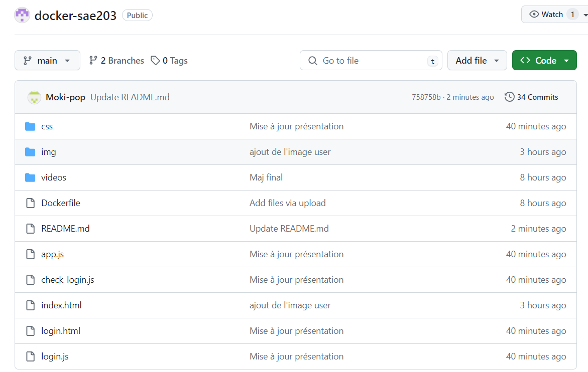

**Nom :** Delpech Nicolas, Kochat Nahel, Thomazeau-Agullo Louis, Razanamasy Henintsoa

**Groupe :** N°2 -A

**Année :** 2023/2024

**IUT Le Havre - Projet_SAE**

### Compte-rendu du Projet_SAE

**Objectif**

Pour notre projet nous avons décider de faire une application qui permet aux utilisateurs de regarder des vidéos à leur demande.

**------------------------------------------------------------------------**
**Liste des commandes utiliser**

**.** git add				**|**	**.** docker build -t <nom image> .
**.** git commit -m			**|**	**.** docker run -d -p 8080:80
**.** git push				**|**	**.** docker ps -a
**.** git pull				**|**
**.** git checkout			**|**
**.** git add				**|**
**------------------------------------------------------------------------**

**Etape 1**
Au tout début nous avons commencer à créer un tout nouveau répertoir dans Githube pour que notre groupe puisse avoir
un moyen de communication pour se partager les dossiers de notre projet se qui donne comme ceci :

**Etape 2**
Pour commencer notre projet nous avons commencer à programmer en HTML et CSS la base de notre application
qui donne comme ceci :

