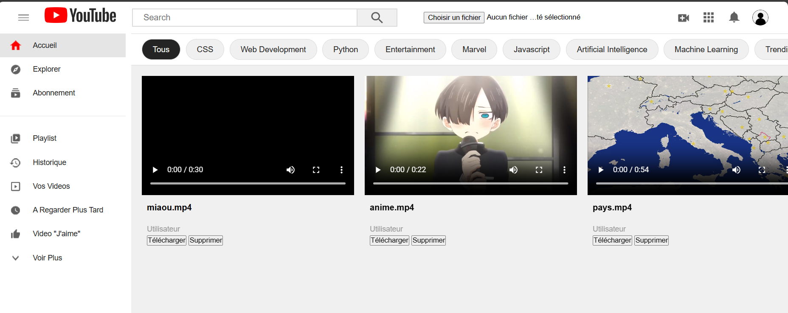
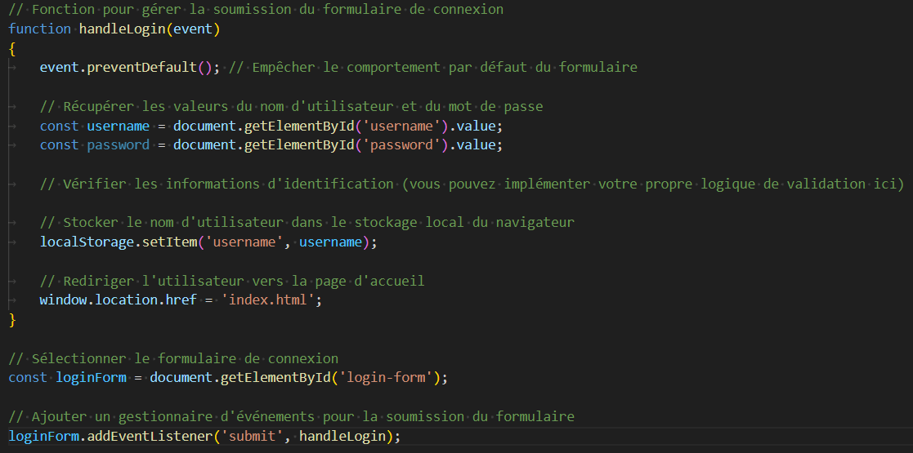
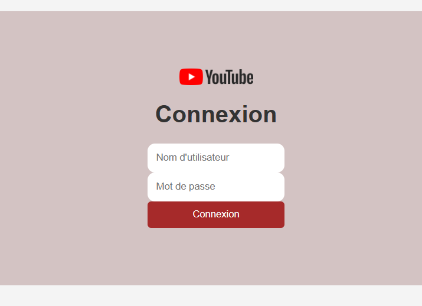
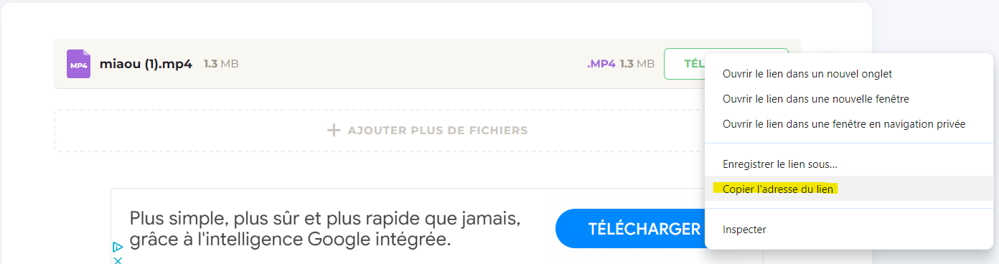
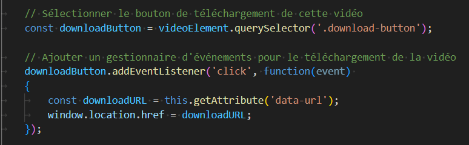
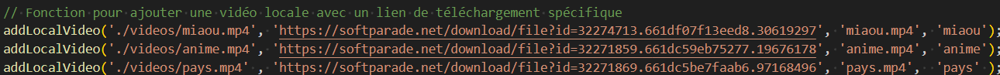
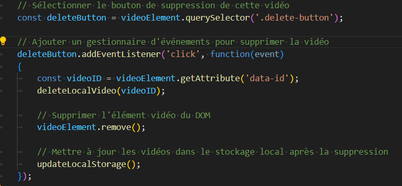
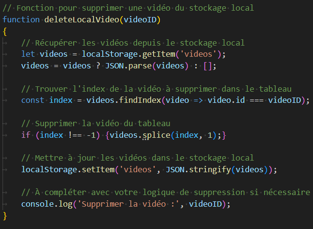

**Nom :** Delpech Nicolas, Kochat Nahel, Thomazeau-Agullo Louis, Razanamasy Henintsoa

**Groupe :** N°2 -A

**Année :** 2023/2024

**IUT Le Havre - Projet_SAE**

### Compte-rendu du Projet_SAE

**Objectif**

Pour notre projet nous avons décider de faire une application qui permet aux utilisateurs de regarder des vidéos à leur demande.

**------------------------------------------------------------------------**
**Liste des commandes utiliser**

**.** git add				**|**	**.** docker build -t <nom image> .
**.** git commit -m			**|**	**.** docker run -d -p 8080:80
**.** git push				**|**	**.** docker ps -a
**.** git pull				**|**
**.** git checkout			**|**
**.** git add				**|**
**------------------------------------------------------------------------**

**Etape 1**
Au tout début nous avons commencer à créer un tout nouveau répertoir dans Githube pour que notre groupe puisse avoir
un moyen de communication pour se partager les dossiers de notre projet se qui donne comme ceci :

**Etape 2**
Pour commencer notre projet nous avons commencer à programmer en HTML et CSS la base de notre application
qui donne comme ceci :

**Etape 3**
Ensuite nous avons réfléchie à des idées pour améliorer notre application.

**Liste des idées à mettre dans notre application**

* Faire une page de connexion pour l'utilisateur
* Faire un bouton de Téléchargement pour télécharger la vidéo qui correspond
* Faire un bouton Importation de fichier -- > ça permet à l'utilisateur d'importer une vidéo pour ensuite la publier
* Faire un bouton Supprimer pour qu'on puisse supprimer la vidéo qu'on a poster

**Etape 4 : La page de connexion**
Pour la page de connexion nous avons utiliser le language JavaScript pour que notre application est des interactions et dynamique.
Ce language nous sert pour la page de connexion de notre application, le bouton du téléchargement, le bouton supprimer et enfin le
bouton d'importer.

**Représentation du code JavaScrip du Login**			**|**		**Représentation final de la page de Connexion**
								**|**		

**Etape 5 : Le bouton Téléchargement**
Pour le bouton téléchargement nous utiliser un site internet qui nous permet d'avoir le lien de notre vidéo en public et de l'avoir
en lecteur MP4.

**Démonstration**				**|**		**Code JavaScript**
		**|**		 

**Etape 6 : Le bouton Supprimer**
Pour le bouton supprimer c'est la même chose que le bouton télécharger on le procède le code dans le même fichier

**Code JavaScript pour le bouton supprimer**

**Etape 7 : Le bouton Importer**
Notre chef d'équipe avais proposer une idée de faire un bouton qui permet à l'utilisateur de importer une vidéo dans notre
application.

**Code JavaScript pour le bouton importer**
